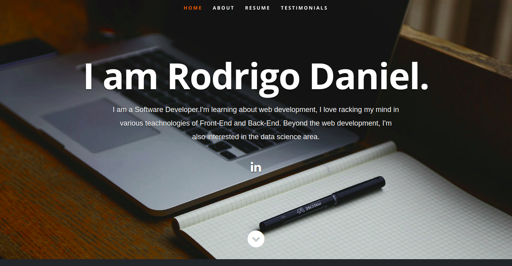

# Personal portfolio
Developed/designed using React JS.
To see it online, check out: https://rodrigodan.github.io/Repository-React/

## Preview


## How to use
1. Clone/Download the repo.
2. Run  ``` npm install ```.
3. Run ```npm start``` or ```yarn start``` to spin the up the local dev server port 3000.(http://localhost:3000).

